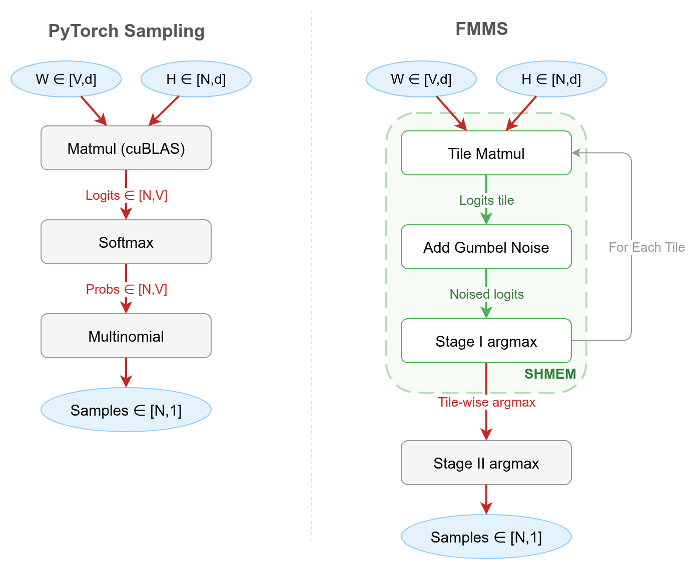

# FMMS Algorithm: Fused Matrix Multiplication & Sampling

High-performance GPU implementation of fused matrix multiplication + sampling using Triton.
This package provides an efficient kernel for sampling from categorical distributions where logits are computed on-the-fly from matrix multiplication, avoiding the need to materialize the full logit tensor in GPU main memory (GMEM).
The key insight is that in LLM decode workloads, both the matmul and the sampling are memory-bound (the matmul collapses to a matrix-vector product).
By fusing both operations, we avoid round-trips to GPU main memory (GMEM) and speed up the sampling process.



## Features

- **Bandwidth-Efficient**: Fuses matrix multiplication and sampling into a single Triton kernel, avoiding materialization of intermediate logit tensors, and preventing round-trips to GMEM.
- **Exact**: Uses Gumbel-max trick for efficient categorical sampling. No approximations.
- **Flexible**: Supports temperature scaling and multiple samples per hidden state vector.

## Installation

```bash
# Clone the repository
git clone https://github.com/tomasruizt/fused-mm-sample.git
cd fused-mm-sample

# Install the package (assumes you're in a virtual environment)
uv pip install -e ".[dev]"

# Verify installation
python examples/basic_usage.py
```

## Usage

For a complete working example, see [`examples/basic_usage.py`](examples/basic_usage.py).
The basic usage pattern:

```python
from fused_mm_sampling import fused_mm_sample_triton

samples = fused_mm_sample_triton(
    weights=weights,        # [vocab_size, hidden_size]
    hidden_states=hidden_states,  # [n_hidden_states, hidden_size]
    num_samples=1,
    temperature=torch.tensor(1.0, device="cuda"),  # scalar (0-d) CUDA tensor
    seed=42  # Optional: for reproducibility
)
# Returns: [n_hidden_states, num_samples]
```

### Parameters

- **`weights`** (Tensor): Weight matrix of shape `[vocab_size, hidden_size]`
- **`hidden_states`** (Tensor): Hidden states of shape `[n_hidden_states, hidden_size]`
- **`num_samples`** (int): Number of samples to draw per sequence position
- **`temperature`** (Tensor): Scalar (0-d) CUDA tensor for temperature scaling (higher = more random)
- **`seed`** (int, optional): Random seed for reproducibility

### Returns

- Tensor of shape `[n_hidden_states, num_samples]` containing sampled indices

### Algorithm

The FMMS kernel implements the Gumbel-max trick for categorical sampling:

1. **Matrix Multiplication**: Compute a tile of logits = hidden_states @ weights in SRAM
2. **Temperature Scaling**: Scale logits by temperature
3. **Gumbel Noise**: Add Gumbel noise to scaled logits tile
4. **Argmax**: Take argmax within the tile to get samples

The FMMS kernel computes these steps in blocks without materializing the full logit tensor, preventing memory accesses, and relieving the bottleneck on the memory bandwidth.

## Benchmarking Method

The FMMS kernel is benchmarked against competitive baselines used in the vLLM inference pipeline.
The baselines follow a two-step pattern:

1. Compute the full logits via a cuBLAS matmul (`hidden_states @ weights.T`)
2. Sample from those logits.

The three baselines implementing this approach are:

1. **PyTorch Compiled**: matmul + softmax + multinomial. Used in vLLM when top-k and top-p are unset.
2. **`flashinfer:top_k_top_p_sampling_from_logits`**: matmul + FlashInfer's dual-pivot rejection sampling kernel. Used in vLLM when top-k or top-p is set.
3. **`flashinfer:sampling_from_logits`**: matmul + FlashInfer's Gumbel-max kernel. Not used in vLLM, but the fastest baseline sampler benchmarked.

Everything is then torch compiled, so the matmul dispatches to cuBLAS.
Their total runtime (matmul + sampling) is compared against FMMS.

Two workload sizes are benchmarked: small (V=151,936, d=4,096) and large (V=128,256, d=8,192).
These configs represent the two dominant LM head shapes across popular LLMs, see the [analysis](findings/lm-head-configurations.md).
The **batch size** (N) ranges from 1 to 256, covering the typical LLM decode regime.

The **arithmetic intensity** of the LM head matmul is approximately equal to the batch size N.
Here N is the batch size, V the vocab size, and D the hidden dimension:

```
FLOPs  = 2 · N · V · D
Bytes  = 2 · D · (V + N)   ≈ 2 · D · V   (since V >> N)

Arithmetic Intensity = FLOPs / Bytes ≈ N
```

The matmul is memory-bound when the arithmetic intensity is below the GPU's ops:byte ratio.
For a detailed derivation, see [`findings/arithmetic-intensity-decode-matmul.md`](findings/arithmetic-intensity-decode-matmul.md).

The following GPUs are used:

| GPU       | HBM Bandwidth (GB/s) | Peak BF16 (TFLOP/s) | Ops:Byte Ratio |
| --------- | -------------------- | ------------------- | -------------- |
| A100-80GB | 2,039                | 312                 | 153            |
| H100      | 3,350                | 989                 | 295            |
| H200      | 4,800                | 989                 | 206            |
| B200      | 8,000                | 2,250               | 281            |
| B300      | 8,000                | 2,250               | 281            |

The ops:byte ratio is peak BF16 TFLOP/s divided by HBM bandwidth (in TB/s).
It determines the crossover point where the matmul transitions from memory-bound to compute-bound.

All benchmarks use PyTorch 2.10.0, CUDA 13.0, and are run on Modal. Results as of 2026-02-11.

## Results

**Kernel microbenchmarks** (full tables, plots, and per-GPU breakdowns) are in the [blog post](https://tomasruizt.github.io/tomas-blog/posts/07_fused-mm-sample/).

### Summary

FMMS is benchmarked against PyTorch Compiled sampling (used in vLLM) and two FlashInfer sampling kernels, on B300, B200, H200, and H100 GPUs.
Two workload sizes are tested: small (V=151,936, d=4,096, representing Qwen3-8B / Qwen3-235B MoE) and large (V=128,256, d=8,192, representing Llama 3 70B / DeepSeek V3).

**vs PyTorch Compiled:**
For the small config, FMMS is faster at **all batch sizes on all GPUs** (1.06-1.52x).
For the large config, FMMS wins at batch sizes 1-64 (20-35% faster) but regresses at N=128+ on most GPUs.

**vs FlashInfer `top_k_top_p`:**
FMMS is up to **2.30x faster** (B300, small config, N=16).
On B300, FMMS is 1.6-2.3x faster across all batch sizes.

**vs FlashInfer `sampling_from_logits`:**
FMMS is 3-25% faster at batch sizes 1-64 on all GPUs.
For the small config, FMMS stays above 1.0x up to N=128 on B300/H100.

### End-to-End vLLM

FMMS is integrated into vLLM ([branch](https://github.com/tomasruizt/vllm/tree/feature/fmms-sampler)) and benchmarked on B200.
On Qwen3-1.7B, FMMS reduces TPOT by 10-19% (peak -18.7% at concurrency 64).
On gpt-oss-120b, FMMS reduces TPOT by 2-4% at low concurrency.

### Sampling Quality

The Gumbel-max trick is mathematically exact (not an approximation).
GSM8K accuracy on Qwen3-1.7B: baseline 89.6% vs FMMS 89.4% (p=0.776, not significant).

#### Running the Benchmarks

```bash
# Benchmark all implementations
python speed_test.py

# Compare performance over many batch sizes
make triton-benchmark

# Run all microbenchmarks on Modal (B300, B200, H200, H100)
make modal-triton-benchmark-all-gpus
```

## Profiling

All profiling scripts are located in the `benchmarking/` directory.

### Memory Profiling

```bash
cd benchmarking
make profile-mem
```

This will generate a memory snapshot and HTML visualization in `benchmarking/memory/`.

### NVIDIA Nsight Compute Profiling

```bash
cd benchmarking

# Profile fused Triton kernel
make ncu-profile-fused-triton

# Profile naive compiled implementation
make ncu-profile-naive-compiled
```

### NVIDIA Nsight Systems Profiling

```bash
cd benchmarking

# Profile fused Triton kernel
make nsight-profile-fused-triton

# Profile naive compiled implementation
make nsight-profile-naive-compiled
```

## Development

### Development Environment

The dev dependencies permit running the scripts in the `benchmarking/` directory. To install them, run:

```bash
uv pip install -e ".[dev]"
```

### Modal Setup
The experiments involving many differnt GPUs were run on Modal. To install and login to Modal:

```bash
uv pip install modal
modal setup
```

Run the speed-test on modal:

```bash
make modal-speed-test
```

## License

MIT License - see LICENSE file for details

## Contributing

Contributions are welcome! Please feel free to create an issue or submit a pull request.
